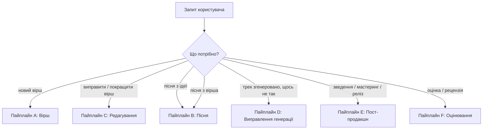
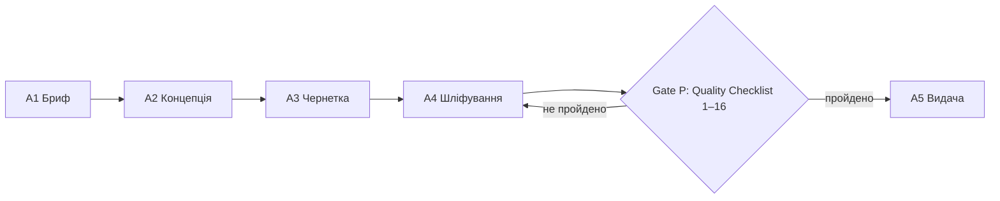
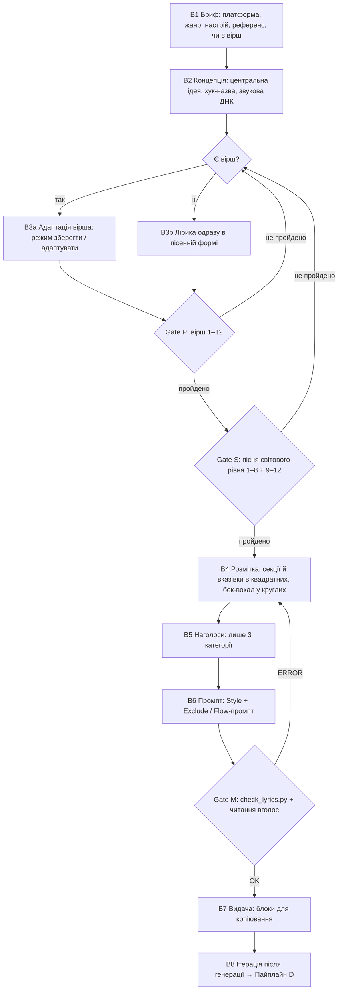

# Пайплайн роботи: вірш і пісня для AI

Документ описує, як агент проходить шлях від запиту користувача до готового вірша або пісні для Suno v6-mini чи Google Flow Music: етапи, контрольні точки (gates), хто що робить і що робити, коли щось не проходить.

Скіли (`skills/*/SKILL.md`) містять правила й деталі кожного кроку. Цей документ — карта всього процесу.

---

## 0. Базові принципи пайплайну

1. **Концепція перед текстом.** Спершу — про що вірш чи пісня, під яким кутом, куди він повернеться і де хук. Потім слова. Більшість слабких текстів — це тексти без центральної ідеї, а не з поганими римами.
2. **Один голос.** Текст пише один автор (агент). Критики дають зауваження, але не переписують по черзі, щоб не вийшов «вірш комітету».
3. **Жоден текст не йде користувачу без перевірки.** Кожен вірш проходить Quality Checklist, кожна пісня — ще й критерії світового рівня та скрипт. Не пройшло — виправ і перевір знову.
4. **Перевірки тихі.** Користувач бачить лише результат, що пройшов. Чеклісти, бали й розбір показуємо тільки на прохання.
5. **Питати мінімально.** Уточнюй лише те, без чого не можна (наприклад, чи можна змінювати вірш користувача). Інше обирай сам і коротко називай вибір.

### Пріоритети при конфлікті критеріїв

Коли критерії тягнуть у різні боки (наприклад, точна рима проти природного порядку слів), перемагає вищий рівень:

1. **Явний запит користувача** (форма, стилізація, «слова не міняй», архаїка на прохання)
2. **Правильність мови:** граматика, наголоси, без русизмів
3. **Ясність і сенс:** зрозуміло, хто, де, що; жива лексика
4. **Образ і щирість:** конкретика, без пафосу
5. **Ритм і рима:** метр, клаузули, співучість
6. **Прикраси:** багата рима, алітерація, внутрішні рими

Правило, що випливає: якщо рима вимагає інверсії, рідкісного слова чи неправильного наголосу — міняй риму, а не мову.

---

## 1. Маршрутизація запиту

| Сигнали в запиті | Пайплайн | Скіл |
|---|---|---|
| «напиши вірш», «сонет про…», «коломийку» | A | `ukrainian-poetry` |
| «покращ», «виправ рими», «перевір наголоси» + текст | C | `ukrainian-poetry` |
| «пісня», «для суно», «flow music», «трек», «зроби з вірша пісню» | B | `ukrainian-poetry` → `ukrainian-poetry-to-suno` |
| «suno співає дужки», «неправильний наголос у треку», «тараторить» | D | `ukrainian-poetry-to-suno` |
| «стеми», «мастеринг», «LUFS», «реклама синглу» | E | `ukrainian-poetry-to-suno` → `references/post-production.md` |
| «оціни», «рецензія», «скільки балів» | F | `ukrainian-poetry` (рубрика) |

---

## 2. Пайплайн A — Вірш

| Етап | Що робимо | Результат |
|---|---|---|
| **A1. Бриф** | Тема, форма, настрій, адресат, обсяг. Чого немає — обираємо за замовчуванням (сучасний регістр, 8–16 рядків, ямб або верлібр). Питаємо лише критичне. | Параметри вірша |
| **A2. Концепція** | Знаходимо **ракурс** (незвичний кут на тему, мікродеталь замість абстракції), **центральний образ** («формулу» емоції з предметів і ситуації), **поворот** (куди вірш зрушить) і **напрям фіналу** (відкритий або парадоксальний, без моралі). Обираємо форму й розмір під емоцію, з огляду на семантичний ореол метру. Для важливих запитів — 2–3 кути подумки, беремо найсильніший. | Кут + образ + поворот + форма |
| **A3. Чернетка** | Пишемо цілим, одним голосом: конкретика замість декларацій, природний порядок слів, жива лексика. | Чернетка |
| **A4. Шліфування** | Рими (різнорідні, без граматичних пар), наголоси й евфонія (`у/в`, `і/й`), прибрати «воду» та інверсії, перевірити переноси рядків і назву. | Відшліфований текст |
| **Gate P** | **Quality Checklist** (`skills/ukrainian-poetry/SKILL.md`): пункти 1–12 обов'язкові, 13–16 — якість понад мінімум; пункт 15 обов'язковий для верлібру. Не пройдено → назад до A4, а якщо проблема в ідеї (немає повороту чи відкриття) → до A2. | Вірш, що пройшов |
| **A5. Видача** | Лише вірш (і назва, якщо вона його посилює). Без коментарів, якщо не просили. | Відповідь |

### A+. Поглиблений режим (агенти)

Для запитів «максимально якісно», «для публікації», «оціни на 100 балів»:

Критики (кожен повертає список `{рядок, проблема, чому, напрям}`, а не новий текст):

| Агент | Зона |
|---|---|
| `poetry-imagery-architect` | Штампи, абстракції, сенсорні якорі, свіжі метафори зі звичайних слів |
| `poetry-emotional-critic` | Пафос, моралізаторство, фальшиві ноти |
| `poetry-prosody-phonics` | Метр, наголоси, евфонія, якість рим |
| `poetry-conciseness-editor` | «Вода», займенники-заповнювачі, інверсії, рідкісні слова |
| `poetry-form-synthesizer` | Одна фінальна редакція, розв'язання конфліктів за пріоритетами (розд. 0) |
| `poetry-qa-bot` | Бали за `references/rubric.md` |

Викликай лише тих критиків, чия зона справді слабка.

---

## 3. Пайплайн B — Пісня для Suno v6-mini / Flow Music

| Етап | Що робимо | Результат | Агент (за потреби) |
|---|---|---|---|
| **B1. Бриф** | Платформа (за замовчуванням Suno v6-mini), жанр і настрій, референс, чи є вірш і чи можна його змінювати. | Параметри пісні | — |
| **B2. Концепція** | **Центральна ідея** одним реченням; **хук-назва** на 3–8 складів; **звукова ДНК**: західний жанр, темп, вокал (характер + подача + простір). Якщо дано референс-артиста — перекладаємо в опис звуку без імен. | Ідея + хук + ДНК | `music-reference-engineer` |
| **B3a. Адаптація вірша** | За `references/poem-to-song-adaptation.md`: режим «зберегти» (лише розмітка й повтори) або «адаптувати» (хук, форма V–C–V–C–B–C, рівні рядки, співучі голосні), зберігаючи серце вірша. | Лірика | `music-lyrics-architect` |
| **B3b. Нова лірика** | Пишемо за принципами пайплайну A (концепція → чернетка → шліфування), але одразу в пісенній формі. | Лірика | `music-lyrics-architect` |
| **Gate P** | Quality Checklist вірша, пункти 1–12 обов'язкові. Виняток: повтор хука й приспіву — прийом, а не «вода». | — | — |
| **Gate S** | **Пісня світового рівня** (`references/world-class-song-criteria.md`): 1–8 обов'язкові (ідея, хук-назва ≥3–4 рази, швидкий вхід, контраст, розвиток V2, конкретність, легкість на слух, співучість); 9–12 — понад мінімум. Плюс тест референсу: чи не вибивається в плейлисті свого жанру. | — | — |
| **B4. Розмітка** | Секції, інструменти, динаміка й вказівки подачі — лише в `[...]`; у `(...)` лише те, що співається (бек-вокал, ехо). | Розмічена лірика | `music-lyrics-architect` |
| **B5. Наголоси** | Велика літера лише в омографах, «російських пастках» і неочевидних зсувах. Зазвичай 0–5 слів. | Фінальна лірика | — |
| **B6. Промпт** | Suno: Style англійською, 80–200 символів, найважливіше першим, без заперечень і імен + Exclude + порада **Variety = Off**. Flow: 2–4 речення природною мовою, трек до ~3 хв. | Style / Exclude / Prompt | `music-prompt-synthesizer` |
| **Gate M** | `python skills/ukrainian-poetry-to-suno/scripts/check_lyrics.py lyrics.txt --style "…" --exclude "…"`: ERROR — виправити обов'язково, WARNING — переглянути. Потім прочитати вголос у темпі пісні. | — | — |
| **B7. Видача** | Блоки для копіювання: Style (Variety: Off) → Exclude → Lyrics; для Flow — Prompt → Lyrics. Плюс 1–3 рядки: що змінено у вірші і що підкрутити, якщо генерація не влучить. | Відповідь | — |
| **B8. Ітерація** | Користувач генерує й слухає → повідомляє проблему → пайплайн D. | — | — |

---

## 4. Пайплайн C — Редагування вірша користувача

1. **Визнач межі.** «Виправ рими» — чіпай лише рими. «Покращ» — можна більше, але голос, тема й ключові образи автора лишаються.
2. **Діагностика.** Пройди Quality Checklist, щоб знайти слабкі місця.
3. **Мінімальні правки** з найбільшим ефектом, у порядку пріоритетів із розділу 0.
4. **Gate P** на результат. Навіть після дрібної правки вірш має пройти пункти 1–12 — у межах того, що дозволено змінювати.
5. **Видача:** виправлений вірш і коротко, що змінено й чому. Тут коментар доречний, бо користувач просив покращення.

Для точкових запитів («перевір метр») — один профільний агент з A+.

---

## 5. Пайплайн D — Виправлення генерації

| Симптом від користувача | Діагноз | Дія |
|---|---|---|
| Модель проспівала вказівку | Вказівка в `( )` | Перенести в `[ ]` |
| Неправильний наголос | Слово з трьох категорій без позначки або надмаркування навколо | Позначити лише потрібне слово; перегенерувати **лише секцію** (редагування секції в Suno / Replace у Flow) |
| Вокал тараторить | Довгі рядки, забагато тексту, швидкий темп | Рядки по 4–8 слів, `[Half-time feel]` у тезі секції, нижчий BPM |
| Звучить як регіональна попса | Слабкий жанровий якір, немає Exclude | Західний жанр першим тегом, посилити Exclude |
| Style «пливе» між генераціями | Variety вище Off | Variety = Off |
| Приспів не впізнається | Приспів різний у тексті або слабкий хук | Дослівний повтор приспіву; повернутися до Gate S, критерій 2 |

Після виправлення знову проходимо **Gate M** (і **Gate S**, якщо змінювався текст).

---

## 6. Пайплайн E — Пост-продакшн (лише на запит)

Стеми → фаза бочки й басу → розмаскування → розділена компресія басу → паралельний дисторшн барабанів → M/S-сайдчейн реверу → мастеринг (−1 dBTP) → реліз (реклама на сингл). Деталі й Gates 7–10: `skills/ukrainian-poetry-to-suno/references/post-production.md`. Агент: `music-daw-mastering-critic`.

## 7. Пайплайн F — Оцінювання

`poetry-qa-bot` за `skills/ukrainian-poetry/references/rubric.md` (100 балів + штрафи) для віршів; для пісень — додатково `skills/ukrainian-poetry-to-suno/references/rubric.md` і критерії світового рівня. Видаємо бали, 3–5 головних проблем із прикладами рядків і конкретні виправлення.

---

## 8. Зведена таблиця контрольних точок

| Gate | Де | Хто перевіряє | Що перевіряє | Якщо не пройдено |
|---|---|---|---|---|
| **P** — якість вірша | A, B, C | Агент (тихо) | Quality Checklist 1–16 (1–12 обов'язкові; 15 — для верлібру) | Назад до шліфування; при проблемі ідеї — до концепції |
| **S** — пісня світового рівня | B | Агент (тихо) | 12 критеріїв (1–8 обов'язкові) + тест референсу | Назад до лірики (B3) |
| **M** — механіка | B, D | `check_lyrics.py` + читання вголос | Дужки, наголоси, довжина, приспів, повтор хука, V2 ≠ V1, Style / Exclude | Назад до розмітки (B4) |
| **Q** — оцінка | F, A+ | `poetry-qa-bot` | 100-бальна рубрика | Звіт користувачу |

---

## 9. Карта файлів

| Що | Де |
|---|---|
| Правила вірша, Quality Checklist | `skills/ukrainian-poetry/SKILL.md` |
| Обґрунтування критеріїв вірша й джерела | `skills/ukrainian-poetry/references/quality-criteria.md` |
| Рубрика вірша | `skills/ukrainian-poetry/references/rubric.md` |
| Агенти вірша | `skills/ukrainian-poetry/agents/` |
| Правила пісні | `skills/ukrainian-poetry-to-suno/SKILL.md` |
| Адаптація вірша в пісню | `skills/ukrainian-poetry-to-suno/references/poem-to-song-adaptation.md` |
| Критерії пісні світового рівня | `skills/ukrainian-poetry-to-suno/references/world-class-song-criteria.md` |
| Факти про платформи (з датою) | `skills/ukrainian-poetry-to-suno/references/platforms.md` |
| Пост-продакшн | `skills/ukrainian-poetry-to-suno/references/post-production.md` |
| Механічна перевірка | `skills/ukrainian-poetry-to-suno/scripts/check_lyrics.py` |
| Агенти пісні | `skills/ukrainian-poetry-to-suno/agents/` |
| Спільні правила | `AGENTS.md` |
| Evals (якість виходу) | `evals/` |
